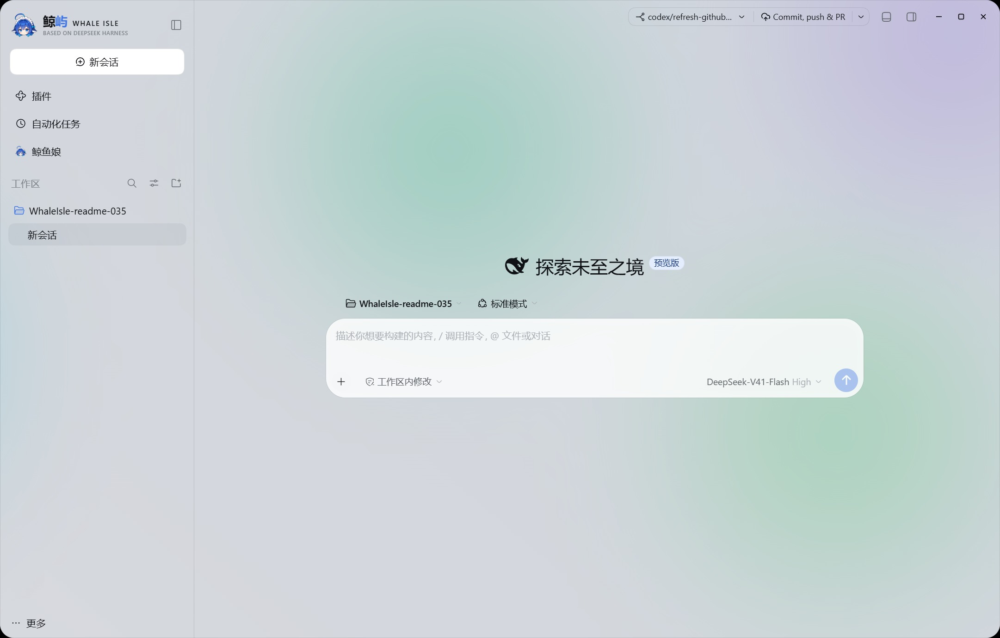
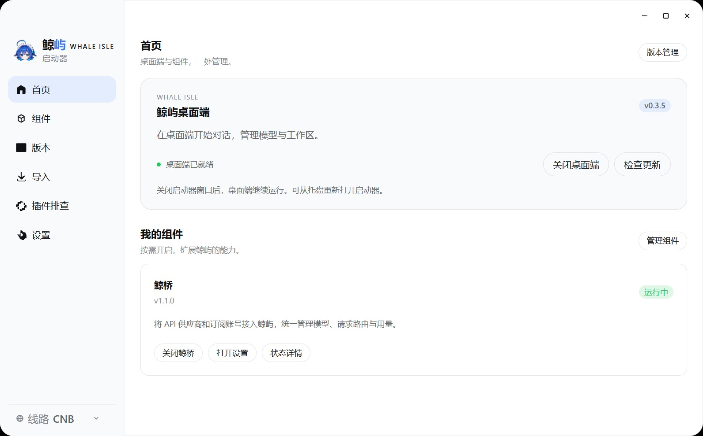
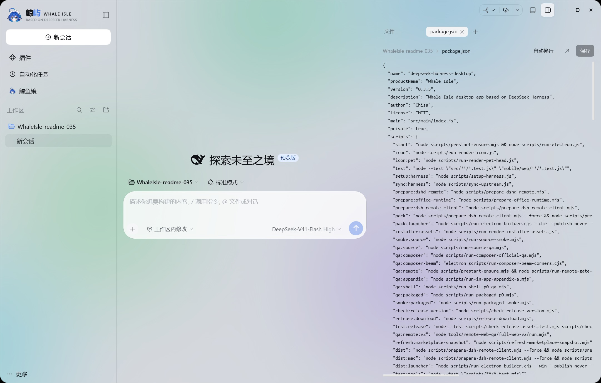
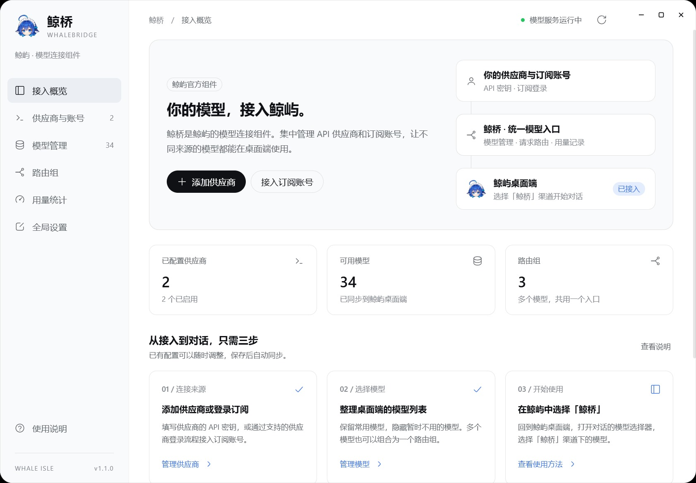
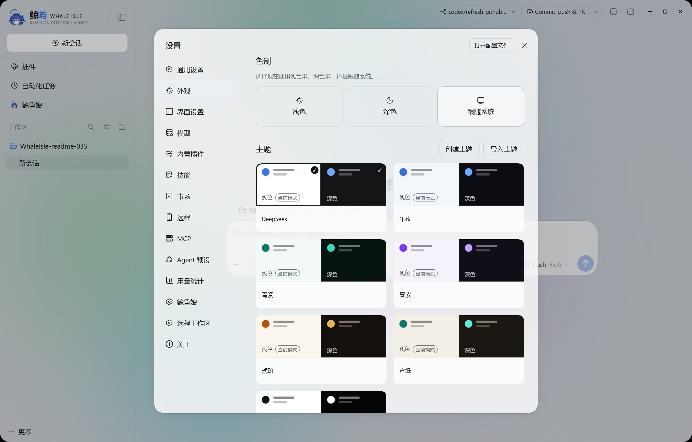

<p align="center">
  
</p>

<h1 align="center">鲸屿 Whale Isle</h1>

<p align="center">
  基于 DeepSeek Harness 的开源社区增强桌面客户端<br />
  在同一个窗口里与 AI 对话、浏览项目、运行终端和管理 Git。
</p>

<p align="center">
  中文 · <a href="README.en.md">English</a>
  &nbsp;·&nbsp;
  <a href="https://github.com/ChisaAlter/WhaleIsle/releases/latest">下载</a>
  &nbsp;·&nbsp;
  <a href="https://github.com/ChisaAlter/WhaleIsle/releases">更新日志</a>
  &nbsp;·&nbsp;
  <a href="https://github.com/ChisaAlter/WhaleIsle/issues">反馈问题</a>
</p>

<p align="center">
  <a href="https://github.com/ChisaAlter/WhaleIsle/releases/latest"></a>
  <a href="LICENSE"></a>
  
</p>

<p align="center">
  
</p>

**鲸屿 Whale Isle 是基于 [DeepSeek Harness](https://github.com/deepseek-ai/deepseek-harness) 的开源社区增强桌面客户端，由社区独立维护，非 DeepSeek 官方产品。** 官方 Harness 的 AI 对话、工具调用、Agent 团队、终端与 Git、MCP、技能和插件等核心功能，这里同样齐备。

在官方能力的基础上，鲸屿 Whale Isle 进一步扩展桌面体验：

- **鲸桥模型接入**：按需安装独立组件，统一管理 API 供应商、订阅账号、模型与路由。
- **更丰富的个性化外观**：透明主题、自定义壁纸、毛玻璃与动态背景，让工作界面更符合自己的习惯。
- **鲸鱼娘桌宠**：常驻桌面的互动伙伴，支持摸头、投喂和随实际 Token 用量成长。
- **扩展用量统计**：跨会话 Token 汇总、使用热力图、费用估算与数据导出，让用量更直观。
- **手机远程连接**：按需开启，通过扫码在手机浏览器访问桌面会话。

会话与配置保存在独立的数据目录中，并提供官方 CLI 数据导入和插件故障排查入口。

## 当前版本：v0.3.5

本版更新了会话顶栏、输入区上下文用量和右侧文件预览，加入鲸桥组件管理，并整理启动器及插件启动恢复流程。截图来自 v0.3.5 正式版；鲸桥通过独立组件通道更新。完整变更见 [v0.3.5 发布说明](https://github.com/ChisaAlter/WhaleIsle/releases/tag/v0.3.5)。

## 功能

- **AI 对话**：管理工作区与历史会话，查看工具调用、确认操作审批，编辑并重新发送消息；支持 Agent 团队与多子代理并行任务。
- **项目工具**：搜索和编辑文件、查看代码差异、预览网页，将文件或终端选区加入对话；Browser 预览支持在聊天区域内切换 mini-player。
- **集成终端与 Git**：在应用内运行命令，切换分支、提交更改、推送代码及创建 Pull Request。
- **模型与扩展**：直接配置模型服务，或通过鲸桥管理 API 供应商、订阅账号和路由；在设置中管理 MCP、技能和插件，通过内置市场安装扩展；内置机器人（Bots）页签可编排多机器人会话。
- **用量统计**：查看跨会话 Token 用量、热力图和按峰谷时段估算的会话费用，支持导出统计数据。
- **桌面宠物** ：Live2D 鲸鱼娘常驻桌面，随 Token 用量成长、推送钉住的常驻通知，支持「看看」「聊聊」与摸头互动。
- **个性化外观**：浅色、深色与透明主题；壁纸图库（必应每日、Wallhaven 与自定义 HTTPS 图源）配合毛玻璃、像素化和流动渐变背景，终端透明度与按钮悬停光泽可独立调节。
- **远程访问**：按需开启远程连接，通过扫码在手机浏览器访问桌面会话；默认不监听远程端口。
- **桌面集成**：托盘驻留、增量更新（只下载变化的安装块），以及启动器中的数据导入和插件故障排查。

## 工作方式

- **本地优先**：会话、设置和插件配置保存在桌面专用的 `dsh-home`，与官方 CLI 的 `~/.dsh` 分开。
- **统一工作区**：对话、文件、Browser、Diff、终端和 Git 围绕当前工作区协作，文件引用和终端选区可以直接回到 Composer。
- **可扩展运行时**：模型服务、MCP、技能和插件由 DeepSeek Harness 的插件机制提供；桌面自有功能通过受控的桌面插件接入。
- **桌面安全边界**：高风险工具操作遵循 Harness 的审批和权限策略；远程功能需要用户主动开启。

<table>
  <tr>
    <td align="center" width="50%"><br />启动器与组件管理</td>
    <td align="center" width="50%"><br />会话与文件预览</td>
  </tr>
  <tr>
    <td align="center" width="50%"><br />鲸桥模型接入</td>
    <td align="center" width="50%"><br />主题与个性化外观</td>
  </tr>
</table>

## 鲸桥 WhaleBridge

鲸桥是按需安装的模型接入组件，可以集中管理 API 供应商、订阅登录、多密钥、模型目录、路由与用量，并将模型同步到鲸屿。供应商编辑支持高级参数与模型范围，模型列表按渠道和供应商分组。

**上游来源**：鲸桥基于 **yetone 的 Magpie** 源码精简开发，保留供应商、订阅、模型、路由与用量能力，将客户端接入聚焦于 DSH，并使用鲸屿的管理界面。上游 MIT 版权与许可证随源码和组件分发保留。

上游项目：[yetone / Magpie](https://github.com/yetone/magpie)

1. 在启动器的「组件」页面安装鲸桥。
2. 打开鲸桥设置，添加 API 供应商或按对应服务的要求完成订阅授权。
3. 返回鲸屿，在模型选择中使用同步后的鲸桥模型。已安装组件也可从侧栏账户菜单打开设置。

鲸桥独立运行和更新，不随桌面安装包附带；关闭启动器后仍可继续服务桌面会话。停止、更新或卸载前需等待活跃请求及工具续接结束。卸载时可选择保留组件数据。API 调用与订阅费用由对应服务商收取，鲸桥不提供免费模型额度。更多说明见[组件与鲸桥文档](docs/features/launcher-components.md)。

## 下载与安装

| 平台 | 下载 |
| --- | --- |
| Windows 10 及以上 · x64 | [下载最新公开版](https://github.com/ChisaAlter/WhaleIsle/releases/latest) |

公开分发以 Windows x64 安装包为主；其他平台可按下方说明从源码运行或构建。版本和变更记录见 [Releases](https://github.com/ChisaAlter/WhaleIsle/releases)。

> [!NOTE]
> Windows 安装包尚未进行数字签名，系统可能显示安全提示。请仅从本仓库下载；发布页提供 `SHA512SUMS.txt` 供核对文件完整性。

### 开始使用

1. 安装并打开应用，等待启动器进入主界面。
2. 在「设置 → 模型」中配置 API 服务，或从启动器安装鲸桥并添加供应商／订阅账号；使用自定义服务时，核对 API 地址与协议是否匹配。
3. 选择项目目录作为工作区，或新建无工作区会话，开始对话。

如果你使用过官方 CLI，可在启动器的「导入」页面选择需要迁移的数据。

## 常见问题

### 需要自己准备 API 密钥吗？

直接接入 API 服务时需要该服务的密钥；也可以通过鲸桥使用受支持的订阅账号，按对应服务要求授权。本项目不提供模型额度或订阅，费用由对应服务商收取。

### 对话提示 `DeepSeek Messages request failed (404)` 怎么办？

先确认使用的是[最新公开版](https://github.com/ChisaAlter/WhaleIsle/releases/latest)，再核对「设置 → 模型」中的服务、API 地址和协议。DeepSeek 接入使用 Messages 接口，第三方服务仅支持 Chat Completions 时，不能直接使用相同配置。

如果仍然失败，请[提交 Issue](https://github.com/ChisaAlter/WhaleIsle/issues/new/choose)，附上版本、服务名称、API 地址（隐藏敏感参数）、所选协议和完整错误信息；不要附上 API 密钥。仅凭 404 无法确定是配置错误还是服务端问题。

### 如何升级？

应用启动时会检查更新。桌面端升级经增量通道下载，只拉取变化的安装块，通道失败时自动回退整包下载；也可以下载新的安装包覆盖安装。桌面版用户通常可以保留现有数据升级；升级前建议备份数据目录。

从官方 CLI 或早期桌面版本迁移，请使用启动器的「导入」，不要直接覆盖数据库或复制整个 `profiles` 目录。导入后重新添加原来的工作区路径即可查找对应会话。

### 数据保存在哪里？

桌面端使用独立的数据目录，不会直接读取官方 CLI 的 `~/.dsh`。可在「设置 → 关于 → 打开运行目录」中查看。

| 平台 | 会话与设置目录 |
| --- | --- |
| Windows | `%APPDATA%\Deepseek-Harness-Desktop\dsh-home` |
| macOS（源码运行） | `~/Library/Application Support/Deepseek-Harness-Desktop/dsh-home` |

### 清理会话日志后，桌宠无法投喂怎么办？

请升级到 v0.3.3 或更新版本。v0.3.3 已修复历史投喂累计值阻塞新增用量的问题，保留成长值与累计投喂记录；升级后的新增用量可继续投喂，恢复旧日志不会重复产生食物。如果仍有异常，请附上应用版本和操作步骤提交 Issue。

### 安装插件后无法启动怎么办？

在启动器的插件排查中禁用出错插件，再重新启动。旧版 dshbot 可能与新版 Harness 不兼容，也可用此方式单独禁用，无需删除配置或会话。

## 从源码运行

开发环境：Windows 10+ 或 macOS 14+（Apple Silicon）、Git，以及 Node.js 22.19+（22.x）或 24+。CI 使用的 Node.js 版本见 [`.nvmrc`](.nvmrc)；pnpm 由根依赖提供，无需另行全局安装。

```shell
git clone https://github.com/ChisaAlter/WhaleIsle.git
cd WhaleIsle
npm ci
npm run setup:harness
npm start
```

`setup:harness` 会安装仓库内 Harness 的锁定依赖并构建桌面使用的 profile，首次执行耗时较长。`npm start` 会在客户端产物过期时先重建再启动。源码版与安装版共用单实例锁，启动前请先退出已安装的应用，包括托盘进程。

```shell
npm test            # 桌面与移动端行为测试
npm run test:tools  # 构建、发布与维护工具测试
npm run docs:check  # 文档相对链接检查
npm run dist        # 构建 Windows 安装包
npm run dist:mac    # 构建 macOS 安装包，需在 macOS 上运行
```

## 文档

- [产品与架构手册](docs/handbook/README.md)
- [界面设计规范](docs/design-language.md) · [动效规范](docs/motion.md)
- [功能契约](docs/features/README.md)
- [开发与维护流程](docs/maintenance/README.md)
- [构建指南](docs/handbook/modules/build-release.md) · [CI 与自动发布](docs/handbook/modules/release-process.md)

## 参与贡献

欢迎提交 Issue 和 Pull Request，参与功能开发、问题修复或文档改进。请在工作分支修改并提 PR，说明需求、实际变化和相关验证；由维护者决定合并。开发 CI 自动提供反馈，成功的 main 构建在版本增加时自动发布，纯文档修改不启动产品构建。详见[贡献指南](CONTRIBUTING.md)。

报告问题时，请附上应用版本、操作系统、复现步骤、预期与实际结果，以及必要截图或日志，并移除密钥等敏感信息。

## 社区

<p align="center">
  
</p>

欢迎扫码加入微信交流群。二维码失效时，请通过 [Issue](https://github.com/ChisaAlter/WhaleIsle/issues) 联系维护者。

## 致谢

感谢 [DeepSeek Harness](https://github.com/deepseek-ai/deepseek-harness) 提供基础能力、[yetone / Magpie](https://github.com/yetone/magpie) 提供鲸桥的上游模型接入能力，以及 [Linux.do](https://linux.do) 社区的支持。

## 许可证

[MIT](LICENSE)
