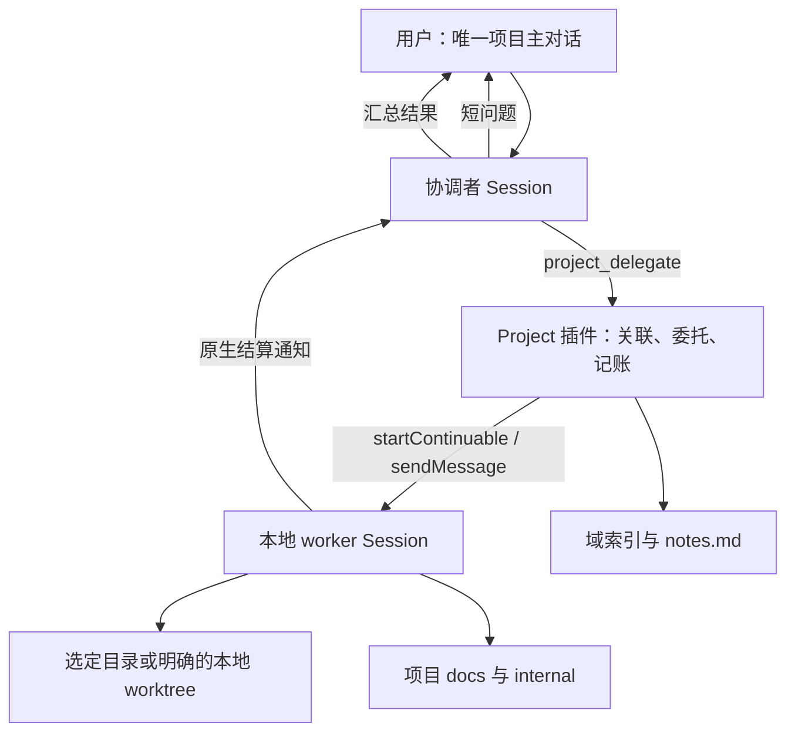

# 鲸屿 Project：本地工作目录、协调者对话与后台 worker

版本：重新设计 2.0 · 2026-10-07

状态：重新设计后的实现方案。用户已授权执行；在独立工作分支重新实现并验证。本文描述目标契约，实际验证状态以功能资料和 PR 为准。

本文以用户最初提供的《Harness Project：协调者会话与后台 worker》为底稿，整体替换此前 1.1 方案。保留原文的协调者、可继续 worker、Session 和项目资料设计；按用户后续要求，将远端绑定和云端默认执行改成本地目录与本地执行，并落实“创建只选目录，真正的工作在对话里”。

原始附件及用户主工作树保持不动。附件中的 Cursor 元数据只是来源信息；与用户后续要求冲突的远端、云端条款不再适用。本文描述目标行为，不能作为已有代码符合设计或已通过验证的证明。

## 1. Project 到底是什么

Project 是一个本地工作目录与一条长期协调者对话的关联。用户选目录后就能开始聊天；项目名称默认取目录名。创建时不收集任务、不填写目标、不初始化 Git、不创建团队、不启动模型工作。

用户始终在这条对话里提出问题、要求执行、追加条件、停止工作和查看结果。协调者直接回答无需实际操作的短问题；需要调查、编写文件、修改代码或验证时，把工作交给后台 worker，再把结果汇总给用户。同一件工作的后续要求继续原 worker。

这里的“本地”指文件、命令和 worker 在本机运行。模型请求仍使用用户配置的服务商；应用退出或电脑关闭后不承诺继续运行。

三个概念各自只承担一件事：

| 概念 | 职责 | 用户怎样接触 |
| --- | --- | --- |
| Workspace | 登记已有本地目录，复用目录身份与文件权限 | 现有目录选择器与文件浏览 |
| Project | 关联目录、唯一协调者 Session、长期资料和后台工作的索引 | Project 分类中的唯一主对话 |
| Workstream / worker | 一件持续工作的稳定身份与执行 Session | 主对话中的进展、结果；必要时查看只读过程 |

Project 不取代普通 Workspace，不把所有普通聊天变成项目，也不要求用户操作任务板才能开发。

## 2. 对原始 Cursor 文档的保留与修改

| 原文内容 | 本方案处理 | 依据 |
| --- | --- | --- |
| 一条长期协调者对话；短回答直接回复 | 保留 | 原文产品主线 |
| 实际工作委托后台 worker；同一工作继续同一 Session | 保留 | 原文执行与续接机制 |
| 使用现有 Session、continuable subagent 和结算通知 | 保留 | 不再建立另一套对话或邮件系统 |
| 协调者只读项目资料并委托，worker 执行文件与命令操作 | 保留 | 原文角色分工；受限的是工具，不是用户输入框 |
| Project 必须绑定 Git 远端，本地文件夹被拒绝 | 改为绑定已有本地目录；Git 和远端均可没有 | 用户明确要求本地 |
| 云端 worker 为默认，缺少云适配器时不能执行 | 删除云端执行链，全部实际执行在本机 | 用户明确要求本地；不留下不可用云占位 |
| 从远端克隆或新建托管仓库后才能创建 | 改为目录菜单直接选择现有目录 | 用户指定的创建入口 |
| 独立工作可以并行 | 保留能力；共享可写目录串行，确需并行写入时使用本地独立 worktree | 云端机器隔离不能直接替换成共享本地目录 |
| Agent Teams 不作为 Project 运行时 | 保留 | 原文明确取舍；“能否结合”不等于必须绑定 Team |
| notes.md、preferences.md、docs/、internal/ | 保留，职责与权限明确 | 原文长期资料设计 |
| 协调者 cwd 为项目存储根，worker cwd 为代码目录 | 保留；在界面与运行记录中明确区分 | 遵守 Workspace 与 Session.cwd 契约 |
| worker idle 就更新工作状态 | 修正为 idle 只表示本轮停止运行；完成必须有明确结果 | 防止中断、失败被当作成功 |
| 原生通知与插件通知可二选一 | 固定只走原生结算通知，插件先记账，不再重复唤醒 | 避免同一结果触发两轮协调者 |
| 停止与业务结果依赖现有生命周期及工具结果，但未明确完整接口 | 增加窄 project_stop 与 worker project_report，复用原生停止/结算，不建立手工验收平台 | 受限协调者必须能停止工作；正常结算不等于业务成功 |
| 删除 Project 时删除物化检出 | 本地用户目录永不由 Project 删除；默认归档保留记录和成果 | 用户选中目录不是应用缓存 |
| PR / CI 信号进入协调者 | 保留为有远端时的可选增强，不成为创建或本地执行前提 | 原文的反馈思路仍可用 |

此前方案中的必需 Team、手工任务创建、任务验收表单、成员管理台、默认独立 worktree 和通用任务扩展模型，不再作为本方案的基础。

## 3. 创建与日常使用

### 3.1 入口

固定路径：

```text
新建对话 → 当前工作目录菜单 → 添加 Project…
        → 现有目录选择器 → 选择本地工作目录
        → 创建或打开 Project → Project 分类下的唯一主对话
```

1. 保留菜单原有目录、“无工作目录”和“添加工作区…”。新增“添加 Project…”直接进入目录选择器，不先打开任务或团队面板。
2. 使用现有 WorkspaceRegistry 规范化目录并取得 WorkspaceId。目录须满足现有目录选择与权限契约；不要求 Git、远端、gh 或有效提交。
3. 以同一应用 profile 中的 WorkspaceId 判断是否已有 Project。同一真实目录再次选择时打开原项目和原协调者；同名不同目录不合并。目录别名通过既有 realpath 机制归一。
4. 初次创建持久化 ProjectId、WorkspaceId、绑定目录、存储根与唯一 coordinatorSessionId。名称可随后重命名。
5. 进入主对话后显示项目名和绑定目录，并提示用户在此提出需求。不自动执行欢迎任务，不消耗模型调用。
6. 取消选择不产生 Project、Session 或空分类，也不丢失原新建对话的输入。打开已有 Project 不把原输入自动发送到它，保留双方草稿。
7. 已归档目录打开原归档记录，可恢复同一个项目；不绕过归档创建第二条主对话。

创建命令在 Host 保证唯一关联，前端禁用按钮只是反馈。创建中断后按已保存身份核对存储根和 Session，只有确认未创建才创建缺项；无法确认时报告错误，不通过再建一份兜底。

已有普通聊天即使绑定相同目录也不被迁移、覆盖或删除。Project 唯一主对话由 Project 导航，不冒充普通 Workspace 的会话成员。

### 3.2 对话中的行为

| 用户输入 | 预期行为 |
| --- | --- |
| “Project 怎么用？” | 协调者直接回答，不产生 worker |
| “看看登录模块现在怎么实现的” | 从对话创建后台调查，返回进展并在结果到达后汇总 |
| “先完善方案，目前只改文档” | 仅委托相关文档工作，禁止把它解释成代码开发、构建或发布 |
| “按这个方案实现” | 委托实际开发；沿用已明确的目录、范围及仓库规则 |
| “刚才那项再加一个条件” | 识别原工作，续接原 worker，不重新创建任务或 Session |
| “前后端分开并行做” | 判断实际目录与依赖条件；需要隔离写入时在对话中说明本地 worktree 安排 |
| “停止这项工作” | 停止对应 worker 及其拥有的活动，不因结算通知自动再开工 |
| “继续上次工作” | 使用原工作与原 worker 恢复，明确当前目录和未完成事项 |

这些都是自然语言操作，不要求用户填写 taskId、选择执行类型、勾选“改变要求”或提交验收表。指代确实不清楚时，协调者在主对话简短澄清；能够从上下文判断时直接继续。

## 4. 运行结构



### 4.1 协调者

协调者用现有 ctx.agents.create / resume 和真实 Session 日志，创建时设置隐藏的 project-coordinator 预设。cwd 指向 $DSH_HOME/projects/<projectId>，不指向用户代码目录。

工具保留 project_read_store 与 project_delegate，另提供调用现有中断能力的窄 project_stop；去掉任意 shell、文件修改以及绕过 Project 的原始子代理启动工具。它可以讨论、澄清、拆分、读取摘要和成果、分派、停止与汇总；不重新执行 worker 已经做过的调查或代码修改。

该限制不是要求用户额外批准，也不是把普通聊天的工具全局关掉。它仅作用于 Project 协调者 scope。涉及目录内容的调查由 worker 完成。

通过 session/presentation.owner = 'project' 管理显示归属。主对话继续使用现有可编辑、可发送的输入链；composer 是否使用 managed 尾控件取决于真实 UI 接线，不以 managed 名称推导只读，更不能做一个没有正常输入框的 Project 首页。

### 4.2 worker

worker 使用现有进程内 continuable subagent，保存 parentSession、origin='subagent'、cwd 和角色预设。首条消息是协调者写出的 brief，采用空 seed，不复制整段协调者聊天。

worker 获得任务所需的普通文件、搜索、命令与 Jobs 能力，并读取真实工作目录中的适用仓库指令。工具权限仍受已有系统权限和当前任务范围约束，不增加全局权限。只增加 cwd 不够：子代理原有父 composition 继承不能把受限协调者的工具集合当成 worker 的执行能力，必须明确装配独立 worker 预设。

worker 使用固定的独立执行预设和不可变 cwd；本轮工具范围在 Project 域中持久化，冷恢复时保持一致。用户从“只改文档”明确转为“按方案开发”时，仍继续同一 worker，不因旧只读预设而丢弃会话。新的范围必须来自真实用户指令，在对应消息实际消费后的执行边界生效；不能仅因消息入队就扩大旧回合的权限。沿用现有 tools.guard 与受限文件工具落实范围，不扩大原生 sandbox 或审批权限。模型选路沿用现有 AgentOptions/descriptor 能力，不改普通聊天的全局默认。worker 不注册 project_delegate，也不自行建立第二层 Project 团队。需要拆出新的持续工作时把理由交给协调者。

后台 worker 不直接成为用户聊天入口。可选过程查看只读；用户追加要求仍从协调者输入。

### 4.3 两个目录的含义

| 目录 | 用途 |
| --- | --- |
| 用户选择的绑定目录 | Project 的工作对象；默认 worker 在这里执行；顶部显示和“打开工作目录”指向这里 |
| Project 存储根 | 协调者 cwd、偏好、摘要和交付资料，不是另一个代码仓库 |
| 可选 worker worktree | 明确并行写入时使用的本地执行目录，需显示其与绑定目录、分支的关系 |

协调者 cwd 不等于 Workspace.path，所以不强行 attachSession 到代码 Workspace。Project 用自己的 coordinatorSessionId 导航。不存在“顶部显示用户目录，后台却偷偷在另一份克隆里改代码”的默认行为。

### 4.4 桌面挂载

Project 仍是 vendor/dsh-project 插件，由桌面 src/main/dsh-project-desktop.js 复用 dshbot 的 junction、desktop-plugins overlay 与 --patch 挂载方式。不改用户 cordis.patch.yml，不复用 Bot catalog，不增加另一种插件加载器。未启用或挂载失败时 Project 入口如实显示不可用，保留普通会话与现有插件启动路径。

## 5. 最小数据模型与权威来源

使用 storageDomain 保存 Project 业务索引，真实聊天继续保存在原 Session。最终域名和版本在实现时统一，不同时维护 Team 日志与 Project 两份工作状态。

| 记录 | 必要内容 |
| --- | --- |
| projects | ProjectId、title、WorkspaceId、绑定规范目录、coordinatorSessionId、存储根、归档状态、暂停状态、创建与更新时间 |
| workstreams | WorkstreamId、ProjectId、title、最新目标及限制摘要、status、稳定 workerSessionId、当前委托回执、最近结果引用 |
| workers | SessionId、ProjectId、WorkstreamId、不可变 cwd、角色/工具 scope、执行模式、可选分支、phase、最近错误 |
| 委托与结算回执 | 原消息/工具调用身份、子消息回执、结算消息身份与是否已归并，用于确认已经发生的有限操作 |

ProjectId 和 WorkstreamId 是插件生成的稳定身份；WorkerId 就是 SessionId。协调者与 worker 均不创建另一套 Conversation 表。

workstream 保留原文的 open / running / blocked / done。blocked 的原因区分等待输入、失败和已停止。worker phase 表示创建中、运行中、空闲或创建失败；停止未完成时显示 stopping，不提前变成 idle。

一件工作可以多轮运行，但不必为每轮建立独立 Execution、Acceptance、KnowledgeVersion 或通用依赖平台。使用既有消息与 activation 身份关联本轮请求和结果，防止上一轮结算覆盖刚追加的要求。

域是业务状态权威；Session 是真实对话与工具执行记录；notes.md 是可读投影；UI 是这些事实的展示。不能解析用户修改的复选框来决定调度，也不能把页面的 running 布尔值当进程事实。

保存业务行不新增 Project 专用 SessionEventMap 记录。必要的显示归属沿用既有 session/presentation；真实传给模型的消息和工具结果才进入 Session。

## 6. 委托工具与工作流续接

### 6.1 project_delegate

接口保留原文语义：project_delegate({ workstreamId?, title?, brief })。本地版删除 place=cloud，不要求用户选择任务类型或运行环境。

新工作不传 workstreamId，由插件建立工作流并分配 worker。复用现有 startContinuable 的 caller-reserved childId，先保存稳定 workerSessionId，再启动子会话；创建中断后核对这个身份，不另建 Session。跟进已存在工作必须传原 workstreamId；有 workerSessionId 时只能 sendMessage，不能再次 startContinuable。

必要的内部执行安排可随 brief/受信选项传入：当前范围、允许修改的位置、依赖本机脏树或进程与否，以及确有需要的并行隔离。它们不是用户必填表单，也不是模型可任意给出的跨目录 cwd。

工具在子收件箱接受消息后返回 workstreamId、workerSessionId、messageId 和真实 phase，不等待任务完成。目录被占用时返回“已排队，尚未开始”，不伪造运行中，也不提前创建空 worker Session。

委托来源须关联实际协调者消息与工具调用。工具 requestId 本身不能冒充用户已经批准开发、发布或发送外部消息。用户当前范围、停止要求及已有授权贯穿后续消息，不为每次委托重复询问。

### 6.2 brief

brief 只包含实际需要的信息：目标、范围、最新限制、工作目录、相关项目偏好/资料引用、已有成果、交付位置，以及需要报告的结果。后续消息是新增要求和必要收口约束，不重复灌入全项目历史。

“仅调查”“只改文档”“不要开发”“不要发版”等限制按实际工具 scope 和写入位置落实。需要修改仓库文档时，允许的是指定文档；不能借 docs-only 名称开放所有代码写入。资料不明确时先确认，不靠虚构的通用权限降级策略继续。

### 6.3 同一件工作

用户的跟进由协调者结合上下文与 notes.md 中的工作标题确定 WorkstreamId。worker 仍活跃时通过现有消息链进入下一边界；已空闲时冷恢复同一 Session。保持原 cwd、分支与对话历史。

Session 或目录真的丢失时，显示具体缺失并保留原记录；不偷偷换一个新 worker 假装续接。用户确需重新开始时，明确建立新工作并引用原历史。

长项目允许工作流归档后按需读取，不把全部历史塞入提示词。已完成工作收到新要求时先重新标记为 running/open，旧完成结果保留，不能用旧结果证明新要求已完成。

## 7. 本地执行、串行与并行

### 7.1 默认：用户选择的现有目录

普通调查、文档与开发直接针对选定目录。创建 Project 不新建分支，不复制目录，不隔离掉用户未提交内容，不为非 Git 目录初始化仓库。

同一规范可写目录同时只有一个 Project worker 占用执行位置。后续独立工作先排队；结束并确认其拥有的活动释放后再启动下一项。来自 follow-up、自动结果通知或重启恢复的请求都走同一个准入判断。

互斥覆盖 worker 拥有的写入、构建、终端 Jobs 和注册服务，而不只看模型是否停止输出。无法确认停止时保留 stopping/blocked，不能释放位置并让下一个 worker 覆盖它。

这只是 Project 内部的协作约束，不能阻止用户、普通会话或外部工具修改同一目录。发现目录不可用或分支已经改变时报告事实并确认续接条件，不自动 checkout、reset 或清理用户修改。

### 7.2 并行只读工作

互相独立的只读调查可以并行，前提是角色实际没有仓库写入与任意 shell 能力。需要运行会写缓存、构建产物或服务的命令时不能仍标为只读，应按可写目录占用处理。

无需并行的工作不为了展示团队人数拆成多个 worker。首版复用既有运行容量，不新增 Project 自己的全局预算、资源键平台或成员人数控制台。

### 7.3 并行写入：明确使用本地 worktree

用户要求并行开发，且工作确实互相独立时，可在本机为各 worker 建独立 Git worktree。它是执行选项，不能成为创建 Project 或普通开发的默认门槛。

条件是 Git 仓库具备可用提交基线。协调者在对话中说明分支、基线和成果如何整合；不要求用户去设置面板填环境。非 Git 目录仍能串行开发，不通过偷偷初始化 Git 来满足并行条件。

worktree 不自动带入未提交修改。任务依赖当前脏树或本机进程时使用原目录串行；需要改用其他基线时先把这个真实差异说明清楚。

worker 的 cwd 创建后固定。同一工作改用别的执行目录属于明确的新安排，不能在冷恢复时悄悄切换。后台 worktree 不为每个 worker 建一个普通侧栏 Workspace 空分类；其路径与打开权限由 Project 的受信关联提供。

多个分支的成果由协调者安排本地整合并报告实际结果。某个分支单独通过不等于组合后通过。Project 不自动把成果合入 main，也不因完成任务就发布版本。

## 8. 完成通知与结果汇总

worker 的报告工具可以结束该轮而没有自然语言收尾。协调者消费原生结算通知时，应在同一消息的模型输入中提供匹配 runId / delegationRef 的持久报告、实际文件、证据和剩余问题，保留原消息身份与授权来源。不能只根据空的 closing message 断言没有结果，也不能用旧报告覆盖当前新要求；这一步不增加消息或唤醒次数。

采用原生 SubagentSettledMessageSource，固定只有一条 worker→协调者主动通知链。插件订阅既有 subagent/end，以 runId/SessionId 对应本轮委托，保存结算事实和待汇总标记、更新 notes.md。原生通知与 end 的发布次序不能保证域先写好，因此协调者 agent/pre-step 必须作为消费前屏障：完成或核对对应事实的持久归并后，才让模型消费通知。具体 await 接线在实现时核对，不仅靠一个 end 监听器宣称时序正确。不追加第二条 project-worker-settled followup。

worker 增加窄 project_report({ delegationRef, outcome, summary, artifacts?, evidence?, remainingIssues? })，outcome 只区分 completed / blocked / failed。completed 表示 worker 报告完成，非独立验收。delegationRef 复用该 worker 已收到的委托身份，运行时核对；Project、Workstream 和提交者从 worker Session 推导，不能由模型指定另一个工作流。报告关联 worker 实际消费的消息，不能把最后入队、尚未处理的新消息当作已完成对象；新要求到达后，旧报告不能关闭新要求。报告保存在当前 workstream 的结果中，不建立 Result/Acceptance 平台。报告工具只记结果、不唤醒协调者；只有真实结算后才能归并工作状态。没有报告、结算失败或已中断时，不能由 idle 推导 done。

现有结算表示子 activation 已空闲、收件箱已空且子树释放，不表示业务目标成功。worker 收尾需明确报告：完成了什么、文件或差异在哪里、实际验证了什么、仍有哪些问题，或者为什么失败/等待用户/被中断。

插件根据本轮报告与真实结算归并状态，协调者根据结果决定汇总、继续委托或等待用户：

| 收到的事实 | 工作流显示与回复 |
| --- | --- |
| 明确报告完成且正常结算，结果对应当前要求 | done；汇总成果和实际验证范围，明确报告与独立验证的区别 |
| 缺输入或需用户决定 | blocked；在原对话提出具体问题 |
| 失败或仅部分完成 | blocked；报告已完成部分与失败原因 |
| 用户中断 | blocked/已停止；保留过程，不自动重开 |
| idle 但没有明确结果 | 不认定 done；显示本轮结束、结果尚不明确 |
| 上一轮迟到通知 | 只更新其对应历史，不能完成当前新增要求 |

协调者可以发起必要的进一步验证，但必须对应未解决的问题，不重做已经完成的调查，也不把 worker 自报成功称为独立实测。没有额外人工验收要求时，不强迫用户点“接受任务”才能结束。

## 9. 停止、退出与重启

停止从现有主对话停止按钮或对话指令发起。自然语言停止调用 project_stop({ workstreamId? })，按钮调用同一受信 Host 命令：有 workstreamId 只停止对应工作；明确停止整个项目时才阻止所有项目委托。命令不发送“停止”brief 启动一个新回合，而是通过现有 subagent interruption/drain 与 Jobs/任务保护链停止拥有的活动。不杀未能确认归属的用户进程。

主对话停止按钮应说明并处理当前项目后台工作，不能只取消协调者短回合、任由 worker 继续写文件。暂时暂停的未处理要求可以保留；已取消的工作必须保留停止标记，不能被旧消息自动恢复。

原文的 keepInbox=true 需要结合具体动作：暂停保留未处理请求以便继续；用户取消/停止则不能让保留消息自动重新激活。它不是一条可不经核对直接复制的实现参数。

普通切换页面不停止后台 worker。退出应用沿用现有任务保护与退出确认，不能增加一个永久系统服务，也不能声称退出后 worker 仍运行。

重启首先加载域和 Session、核对目录及消息回执，恢复可读状态。上次 running 不直接显示正在运行；没有活进程时显示已中断/待继续。用户明确继续后才恢复原 worker；只打开 Project 不启动模型调用。

暂停/停止期间到达的结算允许记账，但不能绕过停止状态唤醒新一轮执行。即使协调者 inbox 在退出时被清空，域中的待汇总事实和对应日志仍保留；下一次用户明确恢复或发送消息时，协调者从域/notes 读取并收口，不再发布一条替代通知制造重复唤醒。恢复前不得通过普通 Session 页面、隐藏 worker 入口或旧消息重放绕开同一准入判断。

“已持久归并”与“已向用户汇总”分开记录。只有协调者产生对应的可见回复后才清除待汇总标记，不能因为 notes 已更新就标记用户已获知，更不能把它称为用户已读。

当前试验代码已出现“暂停后冷恢复时结算通知可能丢失”的验证失败。它是重新实现前必须查清的真实缺口，不在本文假定已解决。先核对原生通知、持久日志、inbox 与 dispose 的责任，再选择必要的最小修正；不为存 Project 状态改写 agent-loop 状态机。

## 10. 项目资料、偏好与文件权限

```text
$DSH_HOME/projects/<projectId>/
  notes.md
  preferences.md
  docs/
  internal/<workstreamId>/
```

$DSH_HOME 使用鲸屿实际 userData/dsh-home，不改读另一个 CLI 家目录。

- notes.md：前部是插件生成的工作流摘要，done 才勾选；以固定分隔标记保留后部用户正文。域更新后生成，不从复选框反向调度。协调者通过读取与回复补充说明；需要保存的内容交给有权限的 worker/项目资料编辑入口，不给协调者开放任意文件写入。
- preferences.md：用户可编辑的长期偏好。在协调者 systemPrompt.assemble 中按 Agent scope 加入，最新对话要求优先。相关部分进入 worker brief，不写入全局 customInstructions，也不扩展所有会话的 AGENTS.md 搜索名单。
- docs/：供用户打开的项目报告、方案和明确交付的资料。实际要求修改的仓库代码或文档仍写到指定仓库位置，不强制把所有成果复制到这里。
- internal/<workstreamId>/：worker 自己的工作笔记，绝不默认为用户仓库的 internal/，避免进入提交或 PR。

project_read_store 只允许 notes.md、preferences.md、docs/**，不允许 internal/**、父目录或任意绝对路径。worker 获得的资料写入位置也仅限自己的 internal 和明确的 docs/ 成果位置，不能借项目权限访问其他 Project。

桌面文档读取/打开只增加当前 Project 的 docs/ 授权根。规范化路径并检查真实目标，目录联接不能越界；不要把整个 $DSH_HOME/projects、用户盘符或所有内部目录加到白名单。

资料编辑和打开使用现有文件/桌面能力的窄接线；不增加知识数据库、向量记忆、通用导出平台或每个文件一套验收实体。历史成果不在无提示下被下一次执行覆盖。

## 11. 用户界面

侧栏 Project 分类每个项目只有一个主对话入口，展示名称与必要的运行/等待状态。首次创建后立即定位，不需要发送首条消息才出现。点击项目始终打开同一 coordinatorSessionId。

主区域是现有聊天界面，顶部显示绑定工作目录。进行中提供简短状态；结果有可打开的文件/差异；停止和确实需要的继续动作复用对话体验。

项目资料可作为附属入口提供 notes、preferences 和 docs。后台工作可通过折叠进展或只读过程查看；默认界面不显示内部 ID、CAS、回执、资源配额、原始 JSON 和通用重试按钮。

以下现有试验交互应在重新实现时移除，而不是改名继续保留：

- 创建前后的“新建任务”表单，以及目标、验收、角色、环境、依赖和资源必填项。
- TaskEdit 需求编辑器与 Guide 第二输入框、“这条消息改变要求”复选框。
- 作为普通操作的成员退役、重建会话、单独启动成员和手工验收工作台。
- 让用户先打开项目总览/看板才找到主对话的导航。

worker Session 不进入普通会话列表或 Project 主对话列表；仅隐藏 worker 条目仍不够，后台执行目录也不能产生普通侧栏空 Workspace 组。只读过程页要能返回原主对话；打开仓库成果或 worktree 差异按其受信目录关联处理，不能因协调者 cwd 在存储根而找错文件。

## 12. 与智能体团队如何结合

多个可继续 worker 在协调者统一分派、互相交接成果并汇总的意义上，已经提供智能体协作。首版按原文使用 continuable subagent，不创建必需的 Harness Agent Team。

ctx.agentTeams 的成员、任务板和邮箱可以作为后续明确需要的协作适配，但不能成为 Project 创建前提，不能强制打开被用户禁用的插件，也不能把 Team 的任务生命周期复制进 Project 界面。

如果以后接入 Team，必须同时满足：唯一用户主对话不变；同一工作续接同一 worker；实际 cwd 与分支隔离可核对；停止与恢复不绕过 Project；工作状态只有一个权威来源。

普通 Agent Teams 的共享 cwd 和 writeScopes 语义保持原样。writeScopes 是提示，不是隔离；不能用它替代 worktree。没有证明有必要之前，不加入 managed Team、任务 CAS 扩展、成员配额与日志版本改造。

本次重设计不删除鲸屿现有普通团队能力，也不把之前用户询问团队结合解释成必须建立团队任务平台。

## 13. PR / CI 的可选反馈

本地核心不依赖 GitHub 登录、远端、PR、检查状态或 webhook。用户确有相关要求时，沿用现有 Git/PR 能力关联真实分支与提交。

保留原文的事实边界：现有打开 PR 查询不等于完整 merged/closed 查询，PR 消失不等于合并；没有 checks 字段就不能报告 CI 通过。查询失败应报告不可用，不覆盖最后真实观察。

自动反馈仅在明确开启后运行。结果必须匹配当前项目、PR 和 head SHA；同一事件不重复唤醒。不能用永久 branch+state 集合吞掉“失败→成功→再次失败”。

如接入现有 verified webhook，Project 规则持久去重后通知原协调者，返回 null，不创建新根 Session。未配置入口时显示未启用，不创建公网隧道，也不用 schedule 当 CI 游标。

PR / CI 扩展在本地委托、续接、停止和结果闭环验证后实施，不为完成创建入口先搭建外部事件平台。

## 14. 归档、禁用与数据保护

归档项目先沿用现有会话活动和任务保护检查；有活动时如实处理停止，再归档。保留用户目录、Session、资料与 worker 历史。恢复时打开原协调者，不换身份。

删除项目记录不是删除代码目录。任何 Project 操作都不得递归删除用户选中的工作目录、远端仓库或未提交内容。应用自己创建的临时 worktree 如需清理，单独核对归属和 Git 状态；不干净则保留并说明。

禁用/卸载 Project 插件保留其数据。域损坏或版本不支持时，Project 功能给出错误并禁止继续写入，不静默重建空域；正常聊天与其他插件仍可启动。不能把 Project 可选插件异常升级为整个鲸屿启动失败。

选定目录丢失、权限改变或 Session 缺失时保留原关联与可读资料，提示处理具体问题。目录换绑须为用户明确动作，不按目录名称猜测替代目录。

## 15. 对已经开发内容的处置

实现位于独立工作树 C:/AI/WhaleIsle-project-agent-teams，分支 codex/project-agent-teams。重做前已保存旧试验全部修改的恢复快照；按本方案撤出错误的 Team / managed Session 平台差异，再实现必要接线。主工作树、main、版本号和发布流程保持不动。

| 现有部分 | 后续处置 |
| --- | --- |
| 目录菜单入口、本地规范目录去重、Project 到唯一主 Session 的导航 | 保留需求，核对实现后复用；仍需真实窗口验证 |
| scoped worker cwd / preset 与冷续接 | 提炼原文需要的最小接线，核对默认行为与兼容性 |
| 项目存储与窄路径授权 | 复用经过核对的部分，按本方案缩小实体与授权根 |
| 必需 teamId、team.bind 与 Team 任务权威 | 从 Project 创建和执行基础中移除 |
| Task / Execution / Result / Acceptance / Knowledge 的全面扩展 | 不作为新设计起点；改成最小 workstream/worker/回执模型 |
| 新建任务、TaskEdit、Guide、成员管理和验收工作台 | 移除默认用户交互，回到主对话 |
| 写任务默认 worktree、后台执行目录普通 Workspace 登记 | 改为默认选定目录，明确并行才隔离，不污染普通侧栏 |
| 为 Project 扩展普通 Team、managed Session 和全局控制路径 | 逐项证明原文目标是否需要；不需要的改动撤出本功能差异 |
| 强制启用被禁用的 Team；Project 启动错误阻断整个应用 | 撤出，恢复插件独立生命周期 |
| PR、知识编辑历史、资源键和通用操作恢复平台 | 不作为首个对话闭环的前置条件 |

不能靠保留大平台、只把按钮藏起来宣称已重新设计。下一轮实现须从本方案的最小运行链审查差异，保留必要能力，撤出错误基础。

此前描述 Team 工作台的文档属于旧试验实现说明，不能继续作为新方案的产品契约。重新实现时同步其负责的产品事实，并区分实现与实际验证状态。

已运行的内部测试不能证明“用户在对话中要求工作→模型委托→真实 worker 执行→原对话返回结果”可用。已有真实模型、冷恢复及打包验收缺口继续保持未通过/未验证，不继承为新方案通过。

试验域数据也不直接当作新 workstream 数据。实施前确认是否存在需保留的真实项目资料；保留原数据，不因改模型而覆盖为空域。无已发布数据时不为首版建立通用迁移系统。

## 16. 后续实施顺序

以下是重新实现的顺序，不是本轮继续开发的授权。不按面板、Team 数据结构或测试平台分工；每步形成用户能在主对话观察的完整行为。

| 顺序 | 修改范围 | 完成条件 |
| --- | --- | --- |
| 1. 本地创建与对话 | 目录入口、Workspace 关联、Project 域、协调者预设与侧栏导航 | 非 Git 目录可创建；取消无残留；同目录打开同一主对话；用户正常发送短问题且不启动 worker |
| 2. 一次真实委托闭环 | cwd/preset 接线、project_delegate、受信目录权限、原生结算与 notes | 用户在主对话提出工作，真实模型调用工具，worker 在正确目录产生所需结果，协调者在原对话汇总；无任务表单 |
| 3. 同工作续接与停止恢复 | sendMessage、消息关联、准入、Jobs/退出保护、冷恢复 | 追加要求保持同一 worker；停止真实释放活动；重启不自动开工；迟到结果不覆盖新要求 |
| 4. 项目资料与长期使用 | preferences scope、docs 打开、internal 位置、归档按需读取 | 偏好不影响其他聊天；资料可打开且越界拒绝；归档保留用户目录与历史 |
| 5. 明确的本地并行 | 受限只读并行、可选独立 worktree、交接与整合 | 并行工作拥有真实正确目录，依赖与组合结果可观察，普通 Workspace/Team 不受影响 |
| 6. 可选外部反馈 | 用户需要的 PR / CI 与 webhook | 只基于真实当前提交通知原协调者，无重复唤醒或新主对话 |

先完成产品行为，再用相关现有检查和必要的定向用例验证。开发 CI 按当前维护流程作为正常反馈；不恢复旧的最终手动 CI、签署或累计次数审批制度。

仍使用独立工作分支和 PR，由用户决定是否合入 main。不改发布版本和工作流，不自动合并。产品运行变化在独立测试环境验证；文档修改无需启动应用。

## 17. 实际验收与证据边界

验证以真实对话路径为中心，复用现有检查；不以新增测试数量、内部接口调用或绿色构建代替用户功能。

| 场景 | 必须观察的结果 |
| --- | --- |
| 新建与取消 | 目录菜单直接选择；取消保留输入；无任务向导、无模型任务 |
| 非 Git 目录 | 正常创建，并能执行用户要求的本地文件工作；不自动 git init |
| 重复目录与重启 | 同一 ProjectId / coordinatorSessionId；无第二条主对话 |
| 短问题 | 协调者直接回复，worker Session 数量不增加 |
| 实际文档/代码请求 | 真实模型从聊天调用 delegate；worker cwd、文件结果和返回对话均正确 |
| 仅改文档 | 只有指定文档变化；代码、构建、发版动作不因委托发生 |
| 工作进行中追加 | 消息进入原 worker，最新要求被执行，不另外创建同类 worker |
| 工作完成后继续 | 冷恢复原 Session、cwd、角色；新要求不会被旧 done 结果结束 |
| 同目录第二项工作 | 排队状态真实；前项拥有的活动未释放时不并发写入 |
| 并行 worktree | 基线与实际文件位置正确；原目录未被暗中切分支；组合成果真实验证 |
| 暂停、停止、退出、重启 | 真实活动与界面状态一致；保留资料；旧通知不自动重开工或丢失结果 |
| 偏好与文件打开 | 仅作用于该项目；docs 可读；internal、其他项目与越界链接拒绝 |
| 普通聊天与插件 | 普通列表、Team、模型默认和被禁用插件不受 Project 强制改变 |
| 归档与删除关联 | 用户目录、脏树和历史保留 |
| 打包后使用 | 安装包中的入口、插件装配、真实委托与返回链可用；源码窗口通过不能替代 |

记录实际验证的代码版本、目录、模型及结果，区分 worker 报告、内部自动检查、真实窗口操作和打包验证。缺少模型凭据或真实环境时如实标记未验证，不改成通过。

## 18. 设计依据与尚待确认的接线

原始设计来源：用户提供的 [Cursor 文档](C:/Users/48818/.codex/attachments/0cc0b0ac-a24e-4877-b707-04477c34bb3b/已粘贴的文本.txt)。其协调者、委托、续接和资料结构是本方案的直接依据；用户随后确认的本地入口、唯一主对话及对话发起工作优先。

后续实施只需围绕以下源码责任点核对：

- [当前维护流程](../../maintenance/README.md)：分支、PR、开发 CI 与发布。
- [Session 与插件导航](../../features/plugin-session-navigation.md)：长期会话和显示归属。
- vendor/deepseek-harness/packages/subagent/subagent/src/{types,child-agent,continuation,continuation-messages}.ts：cwd、角色、消息、结算与冷恢复。
- vendor/deepseek-harness/packages/core/agent/src/{index,runtime-types}.ts：create/resume、followup/steer/inject。
- vendor/deepseek-harness/packages/workspace/workspace/src/index.ts：目录登记和成员关系。
- vendor/deepseek-harness/packages/api/session-controller/src/：现有 presentation 与对话导航，避免无必要的 managed Session 平台改造。
- vendor/dsh-project/ 与 src/main/dsh-project-desktop.js：插件、目录创建桥与窄权限。
- src/main/workspace-authority.js 及 [工作区文件能力](../../handbook/modules/workspace-fs.md)：资料打开与目录授权。
- [任务保护](../../features/task-protection.md)：停止、退出和活动归属。

当前独立分支已经改过其中若干接口，不能把试验接口当作上游原生能力。实施前以分支基线与本方案所需的最小差异区分，尤其核对 cwd/preset 冷恢复、原生结算的记账时序和停止后的消息处理。

此前 GitHub 调研用于了解其他项目的隔离与反馈思路；本次回到用户指定的 Cursor 原文，不据此引入任务看板、组织层级或额外后端，也不声明任何第三方项目是 Cursor Projects 的实现源码。

本次完成的是设计重写。产品代码仍处于停止开发、待按此设计重新审查的状态，未创建或更新 PR。
