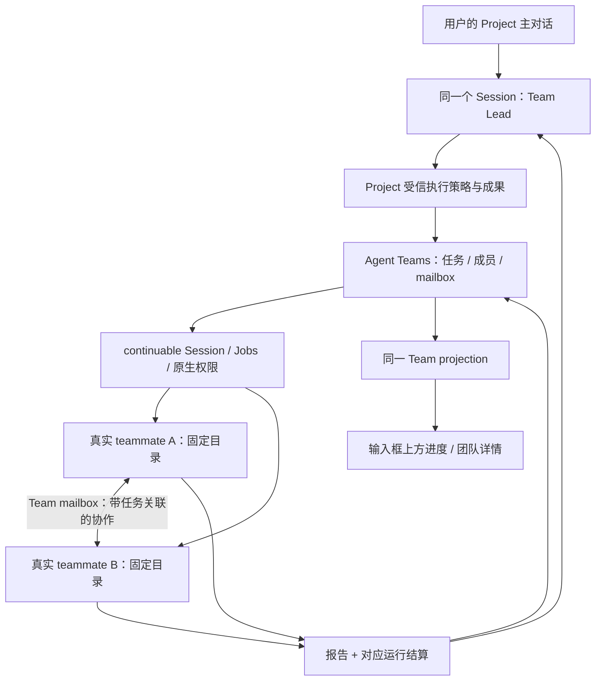

# Project × Agent Teams：实现架构与迁移方案

2026-10-10 · 设计 3.2 · 原生 Team 主链和要求归属、阶段授权、明确交付已接入集成工作分支；当前原生装配与用户路径的验收边界见功能资料，源码实现不代表真实模型或包验收通过。

用户再次明确：Project 必须与鲸屿的智能体团队结合。此前把 Agent Teams 降为可选、用 Project 自建持续 worker 体系的决定撤销。本文件是运行时实现依据；[产品界面与流程](2026-10-08-project-product-redesign.md)保留，涉及团队的部分以本文为准；[配套提示词](2026-10-08-project-prompts.md)同步修订。GitHub 研究见[固定源码依据](../../research/2026-10-08-project-team-runtime-research.md)。

本文保留设计时的基线、拟定接口和实现约束；它们不是当前源码缺口清单或最终 API 文档。实际接线与证据以 [功能资料](../../features/projects.md) 和 [插件说明](../../../vendor/dsh-project/README.md) 为准。当前已采用原生 Team Lead、成员 Session、任务和 mailbox；设计中的独立事件名及伪代码不能覆盖实际 `team/control` 等实现契约。

这里的“结合”有可观察标准：Project 主对话就是 Team Lead；后台执行者是 Team roster 中的真实 teammate；工作就是 Team task；续接与协作使用 Team mailbox；进度和团队视图读取同一份 Team 状态。不是在两套运行时之间同步一个团队标志。

## 1. 设计时核实的本地能力与缺口

以下路径均相对 `vendor/deepseek-harness/packages/experimental/`，检查对象是设计时基线 `4fe72166b` 加当时未提交 UI 改动。表内行号、容量限制与“尚未接线”等描述仅记录当时源码，不代表最新实现；当前组合已有真实模型只读委派与原成员续接证据。

| 代码位置 | 已有能力 | Project 必须补的连接 |
| --- | --- | --- |
| `agent-team/src/roster.ts:92,249` | Root Session 即 Team 身份；持久成员、预留 childId、创建恢复 | Project 协调者直接当 Lead；宿主传受信 cwd、独立 preset、准入策略和预留 memberId |
| `agent-team/src/mailbox.ts:86,116,233` | 先持久 queued，目标持久化后确认 delivered；目标侧去重、FIFO、冷恢复 | 队列/停止/归档策略必须在 Lead 与 child 的最后投递边界都生效；取消旧待发消息不能假装 delivered |
| `agent-team/src/task-board.ts:49,112` | Team task、CAS revision、owner、依赖 DAG | Project 复用任务身份和状态；完成转换必须有本轮报告与真实结算；已停止任务保持 owner |
| `agent-team/src/index.ts:41`、`roster.ts:274` | 默认最多 16 个历史成员，profile 配置 8；任务最多 256 个非 deleted 行 | 长期项目不能第 9/17 件工作就失效；活动容量与保留历史分开，不靠提高常数掩盖 |
| `agent-team/src/projection.ts`、`client-ui-agent-team/src/client/mount.ts` | 现成 Session projection、成员/任务表面、子会话读取 | Project 使用相同投影；子会话在 Project 中只读，普通 Team 继续保持原行为 |
| `tool-agent-team/src/index.ts:33` | 原生模型工具和 Team 协作指引 | 默认共享 cwd、每次显式请求 Team、Lead 等完才回答的策略不能整段套入长期 Project |
| `agent-team-profile/cordis.patch.yml` | Team runtime/tools/UI 组合 | 该 patch 全局禁用旧 subagent 工具，不能为了 Project 原样应用到普通对话 |
| `../subagent/subagent/src/types.ts`、`continuation.ts` | 此分支已有 environment、独立 preset、admissionPolicy 的 continuable 接线 | TeamRoster 尚未向下传这些字段；复用底层能力，不能退回直接启动另一套 Project worker |

已有 Team 的 writeScopes 只是冲突提醒，不是目录锁。成员 active 表示创建成功，不代表现在在运行。interrupt 保留 inbox，不能单独承担“停止后旧工作永不自动恢复”的产品承诺。

## 2. 唯一权威与对象关系



| 事实 | 唯一权威 | Project 是否再存一份 |
| --- | --- | --- |
| 项目名称、目录、生命周期、主对话 | Project 索引 | 保留 |
| 用户目标、修订、真实输入引用与交付关系 | Project 业务记录，引用主对话原文 | 保留；不复制 Session 消息或建立第二套执行队列 |
| TeamId | coordinatorSessionId，沿用 Root Team 规则 | 只保留关联，不生成第二个 Team |
| 工作 id/标题/owner/依赖/status/revision | Lead 日志中的 TeamTask | 不再保存独立 workstream.status |
| teammate 身份、名字、创建结果 | Team roster + 原 Session | 不再保存另一份 workers.phase |
| 消息内容、发送身份、queued/delivered/cancelled | Team mailbox 与目标 Session | Project 只引用 messageId |
| 当前委托、有效范围、固定目录、停止代次、报告与结果引用 | Project 执行记录，按 TeamTaskId 关联 | 不承载 Team 任务状态或 mailbox 内容 |
| 是否仍有实际活动 | continuation 与 Jobs | 读取真实状态；派生 UI 不反向写成事实 |

现有 WorkstreamId 在新项目中就是 TeamTaskId 的产品称呼。旧项目迁移时保留旧 id → TeamTaskId 的映射。Project 的“受阻/停止/正在验证”是 Team task 加当前执行记录的细化显示，不是与 Team status 竞争的另一套任务状态机。

## 3. 装配与权限

Project 使用一个宿主级 `ctx.agentTeams` 实例；已挂载则复用。现有 CLI manifest 已依赖 Team profile，仍要核对最终安装产物闭包和实际 plugin tree，不能以 node_modules 中有文件证明装配成功。

不要全局启用 `agent-team-profile`：其 patch 会禁用普通会话工具。桌面拥有的 Project overlay 只保证 Team runtime 与 UI 能力存在；Project 预设装配自身所需工具和策略。普通 Team 的默认共享 cwd、普通 subagent 工具及用户 profile 设置不随之改写。Project 关闭后不影响独立使用的 Team。

Team runtime 增加宿主注册的 policy seam，按 Root Session 的持久绑定选中策略；普通 Team 无绑定时走既有行为。Project 绑定必须在 Team 自动 recovery/dispatch 前可读；策略缺失时仅对应 Team 禁止执行并给诊断，不先投递再检查。

具体持久绑定采用 Lead 日志中版本化的 `team/policy-bound` 事件，值为 `{policyId, policyVersion, projectId}`，不含用户凭据或任意回调。创建顺序是先建未启动的协调者 Session、提交绑定并 flush，再允许 Agent 激活；原子记录 Project 索引之前的孤立 Session 不得自动执行。Team 的 `scheduleRecovery` 必须先重放该绑定，注册策略就绪后才做运行恢复；缺少实现只允许读取。旧项目迁移先给原 Lead 加绑定，再导入 roster；不能在导入后补保护。此为新增事件契约，需随 Session 后继代际实现。

设计时拟定窄接口（保留表达职责，精确签名以当前源码为准）：

```ts
// 只由受信宿主调用；模型参数不能提供 environment/policy/childId。
spawnTeammate(lead, { ...existingRequest, childId?, environment?, operationId? })
createTask(caller, { ...existingRequest, operationId? })
sendMessage(caller, { ...existingRequest, operationId?, deliveryContext? })
registerTeamPolicy(id, policy) // 根据已持久 root 绑定选择，卸载后 fail closed
```

policy 覆盖创建、任务变更、投递、成员激活、停止与归档准入；deliveryContext 只包含校验后的 taskId、assignmentRef、generation、purpose 和原始授权引用。不是接收模型任意 JSON 的旁路。Team 内部类型必须约束返回值与合法上下文。

`project_delegate` 可保留作模型易用的入口，但 implementation 只能编排 Team createTask/spawnTeammate/sendMessage；不再直接调用 subagents.startContinuable。工具结果返回真实 Team task/member/message 身份。

worker 使用实际 Team 的 `list_agents`、任务读取和 `send_message` 进行必要协作；创建成员、任意改派、提交完成状态和扩大任务权限由 Lead/Project policy 控制。不得同时暴露一套能绕过 policy 的裸 Team 操作。开发成员能力与协调者独立预设，沿用已有角色 guard。

选择 Project 即选择团队驱动的工作方式，普通问题仍直接回答，不机械创建成员。普通 Team 继续沿用自己的启用策略；不每次向 Project 用户重复询问能否使用团队。

## 4. 一次委派：提交顺序与恢复

Project 执行记录增加 `operationId`，从实际用户消息和实际工具调用身份生成。它不是权限凭证；权限来自该用户要求与停止代次。

1. 校验项目可执行和当前授权，持久化委派意图及宿主预留 memberId、固定成员名、目标目录安排；记录为未派发。
2. Team createTask 用 operationId 创建一次任务，重复读取原 task；Project 保存关联。Team 要持久保留创建关联，不能靠“标题相同”去重。
3. 按依赖和真实目录占用决定可否启动。不可启动时 Team task 保持 pending，执行记录保留等待原因；不创建空 member Session。
4. 可启动时预留该目录，TeamRoster 按预留 memberId 持久 provisioning，再用已有 continuation environment 建立真实 teammate。初始请求携带 assignmentRef；创建过程中的执行准入读取已持久的绑定。
5. child inbox 已持久接受后，Team roster 到 active，task 按 CAS 赋给该成员。创建完成前 worker pre-step 等待 task/assignment 绑定提交，不能在 owner 未提交时写文件。
6. 发布投影：派发成功、排队、创建失败分别表达。代码提交与 UI 返回不得把“意图已保存”说成“已执行”。

跨 Project 域、Lead 日志、child 日志没有一个现成原子事务。使用上述有限阶段记录与幂等操作恢复，不声称 exactly-once 模型调用。恢复读取已提交身份：task 已创建就补映射；member 已 provisioning 就核对原 Session/inbox；已接受消息就补确认。无法证明是否接受时停止该项并保留记录，不能新建替身。

Team 创建关联在对应版本化 task/roster/message 事件中持久化 operationId 与创建请求摘要，按 Lead 日志唯一查询；相同 operationId 但不同请求内容返回冲突。Project 保存阶段只是恢复游标，不能覆盖 Team 事件事实。初始 child 的准入等待必须可取消且不占用 Team journal 的事务锁；spawn 返回的是 inbox 接受，不等待模型回合完成，避免 owner 提交与 pre-step 相互等待。

operationId 重放只允许完成已经授权的同一操作，不能在停止后推进未投递的旧意图。记录保留实际 Team task/member/messageId 和提交阶段，不新增通用事务平台。

## 5. 追加、成员协作与依赖

同一工作继续同一 Team task 和 teammate Session。`completed` 的 task 可因同一有效要求的必要下一阶段或明确新要求 CAS reopen；owner 可因原生 reopen 被清除，但 Project 的固定 member 关联保留，重新派发仍指向原成员。原授权内下一阶段不要求用户再次催促；停止后的恢复或超出授权的行为仍需新的用户输入。active 工作追加通过 Team mailbox 去原成员最近边界；用户看到“追加已接受”，直到实际消费后才成为新执行范围。

Team mailbox 的 `accepted` 是持久投递观察，不是成员已理解或执行。运行回执另外记录被实际消费的 assignmentRef；旧权限不能因为一条新消息入队就扩张。

成员协作使用真实 Team peer message：例如后端成员发送接口说明给前端成员。宿主加当前任务/代次关联，来源显示成员姓名。peer 内容是协作材料，不是新用户授权。空闲但仍有已授权活动任务的成员可在准入后被唤醒；已完成、已停止或封存成员不能被闲聊/迟到消息重新开工，其消息保留为待用户继续时可读资料。

设计时 Project pre-step 只认识用户委托/原生结算等来源，不能原样沿用。接入真实 `team-message` source 时，向 Team journal 核对 messageId、同一 Team 的 sender/target、受信 deliveryContext 与当前 assignment；模型正文内的 DelegationRef 不算身份。peer 消息只作为当前已授权任务的材料，不更新 scope 或用户消息截止点；只有 Lead 经 project_delegate 发出的受信 assignment 才能更换本轮要求。

有执行先后关系时使用原生 TeamTask.blockedBy DAG。任务 ready 本身不启动成员；Project 调度在依赖完成且目录可用后派发。依赖仅由真实完成状态满足，失败报告、模型 idle 或仅声明完成都不能解锁。

结果记录所依赖的上游 resultRef/assignmentRef。上游后来追加不会抹掉下游历史结果，但应标出其依据已变化；Lead 根据新用户范围安排受影响的后续，不能静默把旧结果当作验证新改动。

## 6. 本地文件执行世界

Team 默认共享 cwd 保持不变；Project policy 为本 Team 每个成员提供受信 environment。协调者仍在资料根，执行者在绑定目录或明确创建的独立 worktree。

同一规范目录的可写活动由 Project 宿主统一准入，跨 Project Team 的同目录执行也核对实际占用；该机制不锁住外部应用。Team writeScopes 仍是提示，不能冒充隔离。

只读调查可并行，任意 shell/构建不属于只读。并行写入必须具备用户认可的隔离安排；非 Git 目录串行，不能为了并行偷偷 git init。worktree 的 canonical path、来源仓库、branch、创建归属与权限由桌面核对；分支整合是一项可见 Team task，由获准成员执行，协调者不越权改代码。

目录占用释放统一触发等待项推进，覆盖正常结算、启动前失败、取消和 Jobs 最后退出。磁盘上 task completed 也不能提前释放仍有 Jobs 的目录。

## 7. 报告、任务完成与用户交付

`project_report` 继续提供明确业务结果；report 包含 TeamTaskId、当前 assignmentRef、实际成果/验证/剩余事项、依赖结果引用。报告先持久化，匹配的原生 settlement 证明本轮运行已结束后，才能按 CAS 把原生 Team task 置 completed。

需要修改 `TeamTaskBoard` 的 policy seam：Project 成员直接调用 complete 时必须满足上述证据，不能绕过报告；普通 Team 保持原控制契约。受阻/失败时保留任务与原 owner，执行记录提供原因，不误标 completed，也不靠 release 丢弃持续身份。

结果顺序：报告落盘 → 原生捕获真实 terminal 并完成资源排空 → 持久结算回执 → Team complete 提交 → 发布结果与依赖 ready → 原生通知触发 Lead 汇总。不要再通过 Team send_message 额外发送完成通知。

设计时 continuation-activation 的顺序是先 notifyManagedSettlement，再 observer.settle 发 subagent/end；现有 admission 回调只有 parent/childId/reason。因此不能在 admission 里等待稍后才产生的 end 事件，否则会自锁。需新增受信 `commitSettlement({parentId, childId, runId, terminal})` 接点，在原生已完成排空并捕获 terminal 后、通知之前调用；Project 按实际 run 持久回执并提交 task，不等待 subagent/end 或 ownership release。目录预留仍以真实 Jobs 与排空事实为准，不能因 task completed 提前放行。该接点失败不能阻碍释放原生所有权和发 end；应保留不可自动执行的待对账状态，禁止唤醒 Lead，并显示记账故障。普通未管理 subagent 保持原结算路径。

崩溃在任意间隙时按 task revision、assignmentRef、原生 runId 和已保存报告对账。没有原生结算证据就不能完成；Team complete 已提交但 UI 未更新时重建投影，不能再执行任务。历史结果不会完成刚 reopen 的新要求。

成员报告使用稳定 resultRef，至少含 `{teamId, taskId, assignmentRef, reportId}`，由宿主验证。用户交付另按第 13 节关联要求版本与实际主对话回复。模型可以用自然语言总结，不要求逐字复述标题；读取报告和任意回复不消除“待交付”。已交付不等于已读，汇总失败仍可打开成员报告。

## 8. 停止、旧邮箱和重启

现有 Team interrupt 保留 inbox，现有 recovery 自动处理 queued-minus-delivered；因此只把 project_stop 接到 interrupt 是错误的。

- 每项目与每工作有持久停止代次。点击停止先同步关闭内存准入并取消相关活动，再保存新代次；保存失败不阻断真实取消，停止保持和错误必须可见。
- Team mailbox 增加取消/撤销 disposition（版本化的新事件），保留原 queued 与撤销原因。旧代次尚未投递的消息明确 cancelled，不写假 delivered；新消息获得新身份和有效代次。取消是邮箱终态，FIFO/recovery 查询排除 cancelled，与 delivered 一样不阻塞后续消息；取消与投递结果在同一 journal 串行核对，不能撤销已经实际消费的历史。
- 目标 inbox 已接受但未消费的旧消息也在 pre-step 的来源校验中排除执行，保留审计记录。需要 continuation 提供按受信消息身份撤销 pending 的受控接点；不能改写历史 user/message 来“删除”证据。
- 最后投递检查同时覆盖 child 的 host-steer、已驻留成员、冷恢复、Team recoverFor 和发给 Lead 的 root.steer。不能只保护 spawn。
- generation 校验之外还核对项目是否正在停止/归档、当前工作授权与目录占用。停止前已进入同步投递边界的消息由 pre-step 再核验，并随正在运行的活动一起 drain。
- 等待真实 continuation 与所属 Jobs 排空后才显示已停止。成员间消息和结算通知不能绕过停止保持。外部进程不杀。
- 新的明确用户要求创建新代次/新委托，只恢复选定工作，不顺带回放所有历史 mailbox。队列旧内容可读，但不能当作新授权。

重启先完成 Project 绑定、停止保持、Team 日志和原 Session 的只读对账，再允许受信 recovery。默认不开模型、不投递旧执行请求；历史 worker 仍可通过原身份恢复。归档期间关闭新准入；失败保留未归档记录和停止保持。

## 9. 长期团队容量与历史

设计时历史成员永久计入 maxMembers、已完成任务永久计入 maxTasks，不满足长期 Project。设计要求用 Team 原生冷置能力区分活动与历史，不能删成员或换主对话规避；当前冷容量接线见功能资料。

拟定版本化 roster/task 快照增加 `archived` 生命周期标记，创建 phase 的 provisioning/active/failed 含义保持不变。Project 中已经结束本轮活动（完成、停止、失败或需要外部输入），且真实排空、无可执行 mailbox 的成员与任务可自动冷置，使用这个原生封存标记；名称、SessionId、taskId、原 owner、未完成 status、报告和日志全部保留。冷置只表示不占活动容量，不等于完成或归档整个项目；TaskDock 中未完成的阻碍仍可见。用户不需要手动“退役成员”。尚待依赖/目录/容量且可自动推进的排队任务不冷置其待执行意图；原生成员容量只在实际激活时占用。

活动容量计算排除冷置记录；历史按需分页。任务板待处理队列达到 maxTasks 时说明容量并保留用户主对话请求，不能暗中丢任务或把活跃排队项假装结束；已结束本轮的历史不会永久吃掉该额度。任务依赖仍能查询已封存的 completed 事实，不使用 deleted tombstone 代替归档。新要求先按 CAS 激活原任务/成员，有空闲容量才派发，容量满时明确排队；失败成员不自动替换身份。Lead 可在原要求的有效授权内根据实际失败安排必要替代工作，说明原因并关联旧记录；原用户只授权调查时，替代不得升级为修复。

原生 Team 客户端与工具都理解该版本字段，普通 Team 保持现有容量默认，新的封存操作可作为通用能力但不强迫原用户使用。所有持久类型改动遵循已发布 Session 代际规则，新增后继读取与变换，不覆盖旧代事件定义。不得通过只增大 maxMembers/maxTasks 宣称长期问题解决。

## 10. 团队界面与 Project 进度

保留用户确认的统一侧栏和折叠任务条。折叠条从原生 Team task/projection 与 Project 执行细节派生，而不是单独轮询另一份工作列表。

展开时看到工作标题、负责成员、依赖/排队/阻碍和成果；提供“团队”附属入口，复用鲸屿现有成员/任务组件及同一 projection。成员只读过程仍通过真实 parent-child Session 绑定打开，可看互相协作的消息，输入继续留在主对话。

设计时 TeamAction 的 openTeammate 会打开 continuable 子会话，Project 场景必须注入只读过程打开策略；普通 Team 不受影响。不能仅隐藏文本框而保留可发送的后台命令；Project role guard 拒绝绕过主对话的直接用户执行入口。

UI 的 running 来自 Session/Jobs，task owner 来自 Team，blocked 等原因来自当前 assignment。两处视图应显示同一工作、同一成员与同一结果。项目资料保留成果/笔记/偏好，Team mailbox 和 internal 不是另一个用户聊天页。

## 11. 旧实现与数据迁移

保留：本地目录入口、Project 唯一主对话、docs 权限、资料编辑、真实文件预览、TaskDock；复用底层 continuation environment 和 Jobs 排空。

替换：Project 自建的成员列表、任务状态、发送与调度重复实现。将 `project_delegate/report/stop` 收紧为原生 Team 的产品适配与执行策略。不能在旧 Project workers 与 Team members 之间做长期双向同步。

旧数据不得丢弃。独立 profile 先只读扫描版本与记录；原 coordinatorSessionId 直接成为 TeamId。由宿主的受限 adoption 操作验证已有 child 的 parent、descriptor、cwd、preset、当前状态后，导入真实 Team roster 和 task 关联，沿用原 Session，不伪造初始 prompt 或重启工作。

迁移按每项目记录幂等映射与阶段，先保留旧域原文、资料和日志。验证新投影可读且身份一致后切换权威；旧域只读留存，不再双写。部分失败只阻断该项目并给出原因，普通项目与对话照常。没有凭证可证明的 child 不强行认领或新建替代；可保留资料与主对话只读。

## 12. 具体改动地图与实施验收

| 批次 | 负责文件 | 完成条件，不是已完成声明 |
| --- | --- | --- |
| A：原生 Team 执行接线 | `agent-team/src/types.ts,roster.ts,index.ts`；`dsh-project/lib/presets.js,lead.js,service.js`；desktop overlay | 实际 Project Lead 下创建真实 teammate，独立 cwd/preset 生效；原生团队视图显示同一成员和 task；普通对话工具不变 |
| B：准入与 mailbox | `agent-team/src/mailbox.ts,lifecycle.ts,journal.ts,projection.ts`；continuation internal/pre-step；Project policy | 持久投递一次、重复恢复去重；停止后旧 pending 和 Lead message 都不启动模型；归档竞态与写入故障仍能停 |
| C：任务与结果 | `agent-team/src/task-board.ts,task-view.ts`；Project report/settlement 与资料模块 | Team CAS complete 只能由本轮真实报告+settlement完成；依赖正确解锁；新要求不被旧结果覆盖 |
| D：长期数据与 UI | Team 持久类型/迁移/分页；Project 迁移；TeamAction/TaskDock/WorkspaceBrowser | 超过当前8/16名历史成员仍可创建和原人续接；迁移保留原身份；两处状态一致、只读过程与成果可用 |
| E：真实交付 | 官方 profile 构建、源应用、安装产物 | 原入口真实模型完成协作、续接、停止与恢复；安装包组件闭包齐全，真实画面通过 |

第一个实现切片是 A 加最小报告返回链：从对话提出只读调查，真实 Team task/teammate 在正确目录执行，结果回到原对话，追加继续同一个成员。不能先把所有新 UI 做完再补底层，也不能拿一个写入Team表的 mock 代替这个切片。

之后覆盖一条真实协作案例：后端成员产出接口说明 → Team peer mailbox 给前端 → 前端在依赖满足后继续 → 验证/整合成员报告实际组合结果。只有用户明确要求独立审查时才增加审查成员，不为表演固定多代理流水线。

最小故障观察必须覆盖：child接受前/后崩溃、目标接受后Lead ack前中断、报告保存后complete前中断、停止与派发并发、暂停状态的旧邮箱、目录启动失败释放、单项目资料失败、Team包缺失与普通会话不受影响。先实现对应产品能力，再准备必要定向检查；不跑无关全量测试。

当前已实现原生 Team 主链、真实成员协作与同一 Session 续接，并补齐实际排队原因、当前依赖成果冻结、准备期依赖重开、可恢复的汇总失败和有界历史读取。真实模型、Host 故障检查、可见 UI 与当前包内工程验收的证据边界由[功能资料](../../features/projects.md)统一记录。上述 A–E 是原生接线阶段的地图，不是 3.2 已完成声明；本次整体业务缺口按下节和产品文档的连贯场景落实。

## 13. 要求、阶段与交付的业务接缝（3.2 源码已接入，整体验收进行中）

`domain.js` 现增加可选 Request/Delivery 记录，`service.source` 保存本轮领取的全部真实人类输入；阶段委派绑定要求版本。`requirements.js` 承担明确交付声明、真实回复、completed 回合结束及持久 flush 对账。读取 notes 加任意回复不清除待交付。以下说明已接入的业务合同；当前原生组合、真实 provider、完整 UI 和包内验收以功能资料为准。

### 13.1 两类业务记录

| 记录 | 必需事实 | 不拥有的事实 |
| --- | --- | --- |
| Request | 项目与稳定要求身份；有序真实用户输入引用；版本及修订关系；目标、有效限制与完成条件；授权上限及原始来源；所关联工作 | Session 消息正文、模型运行状态、Team 任务状态、命令审批决定 |
| Delivery | 要求身份与版本；可扫读结论、验证与未满足条件；真实报告/文件引用及适用依据；实际主对话回复的 Session/messageId | 成员报告正文、原生结算、用户“已读”、永久 Project 完成标记 |

要求版本不可被后来消息悄悄覆盖。新增输入先保留原生已消费消息的身份和顺序；Lead 判断是解释、补充还是新目标，并显式关联相应要求。宿主验证输入确实来自本 Project 的人类主对话和实际领取批次，不能只用最后一句，也不能将 peer、动态上下文或结算通知当成人类输入。不存在“每条聊天都创建一项任务”的产品规则。

模型对目标的描述负责业务组织，不授予额外执行权限。原始授权引用保留用户真实输入、Project 固有策略及原生权限决定；执行权限始终受这些限制。既有原生单次命令批准只适用于它批准的实际操作，不能因 Request 持久化成为长期通行证。

在人类输入的接纳/修订边界声明并保存该版本的 scope 上限与 docs 允许写入位置，沿用当前权限表达和来源校验；通知不能修改这些字段。目标和上限按用户版本冻结，但必要工作可在该版本内根据真实反馈动态登记。工作登记引用准确的 workstreamId/委派身份；查阅资料和成员互相提供信息不能自动变成必需执行阶段。

### 13.2 原要求上限与当前阶段范围

委派记录新增要求身份与版本，继续使用已有 `delegationRef/runId`、停止来源截止点和固定成员/目录身份；当前进程内的 `workerStops.generation` 不能冒充已经持久化的域字段。每次成员委派的 scope 是阶段范围：完整修复要求可以先调查，再在原授权内安排修复、验证和必要整合；用户只要求调查时不能跨到修改。调度依据是尚未满足的要求与实际反馈，不是提前固定三个成员或三道工序。

结算回到原主对话时按真实工作/委派/运行身份定位原要求。原要求仍有效、未停止且项目可执行时，Lead 可以安排为完成它所需的后续；不能因为当前轮只有结算通知就要求用户再说一次“继续”。有新的无关用户消息时也不能将旧结果挂到新目标。停止、归档、重启保持及权限撤销仍阻断推进；需要超出原授权的行为才等待新的用户授权。

`ProjectApprovals.requested` 改为核验有效要求的真实授权来源与当前原生策略，而不是仅核验当前 turn 内有没有人类消息。成员在允许请求审批的开发阶段可以沿用原生请求入口；真正执行仍等待本次命令的原生决定。运行中的范围改变在实际排空、消费新委派后生效。新委派显式记录取代哪份未消费旧委派，旧 queued 保留为撤销事实；已消费的旧运行与报告不改写。

### 13.3 声明交付与绑定实际回复

Lead 明确提交针对某个要求版本的交付草稿：结论、满足及未满足的条件、使用的报告/文件引用与验证边界。声明时冻结必需工作的准确 `{workstreamId, delegationRef, runId}` 和复用的 reportId 等证据清单，而不是在首次人类输入时预定全部未来阶段。宿主核对要求版本、引用归属、匹配的原生结算和尚未排空的相关工作；不能把仍有必要工作的要求标成完整交付。部分结果可以交给用户，但未完成项继续可见。

当前原生 `assistant/message` 没有 final 标志；草稿关联实际声明 tool call、Lead Session 与 turn。声明后的最后一份非 tool-call、非 interrupted 的可见文本回复只是候选；等该 turn 的 `turn/end.reason.kind === 'completed'` 后重核要求版本和精确证据。新增或取代了必需阶段时草稿不再适用，重新声明；异常、中止、截断或缺少候选回复不形成交付。

随后 `await ctx.sessions.flush(lead.session)`，确认持久监听参与且成功，再提交带真实 Session/messageId 的 Delivery。turn/end 本身不保证落盘。提交失败保留草稿与原日志关联，按真实回复/turn/引用重新对账，不重跑成员；不存在的回复不能由目录记录假造。绑定使用明确交付意图，不从“本轮读过哪些报告”推断。宿主负责校验身份与执行证据，模型负责解释这些证据是否满足自然语言目标，不能声称结构校验自动证明业务正确。

当前版本的适用性与历史执行结果分开保存。上游或要求变更时，旧交付仍是它原版本的交付；当前界面显示待复核或未满足项，不能删去旧事实，也不能仅因为所有历史 Team task completed 就显示本轮已交付。纯解释直接在原对话回答；沿用已有成果的交付可引用旧证据，不为生成交付记录启动新成员。

### 13.4 兼容与展示

现有 Project catalog 增加可选业务记录及关联字段；保持当前读取版本可兼容，不仅改 version 后拒绝旧目录。历史 Project、成员、委派、报告、文件及停止记录不变。只关联可由原生来源证明的旧事实，不从旧标题或已完成状态捏造要求版本或交付；用户继续旧工作时可建立明确的新要求版本，并引用原工作与报告。

TaskDock 查询当前要求的真实工作、阻碍、待交付和适用性。资料先呈现用户交付，再下钻成员报告；Team 默认当前参与者与近期工作，历史成员/任务按需分页。冷置释放活动容量不等于界面有界。记录按真实要求、委派轮次和时间组织，不改写原始消息。资料、旧版本、成员记录和文件之间保留项目归属与返回位置；未保存笔记由原项目持有。

完整完成标准统一采用产品文档第 11 节的八条连贯场景。原生身份、安全边界、目录排空与历史保留仍是底座，不以新业务字段替换这些事实。
